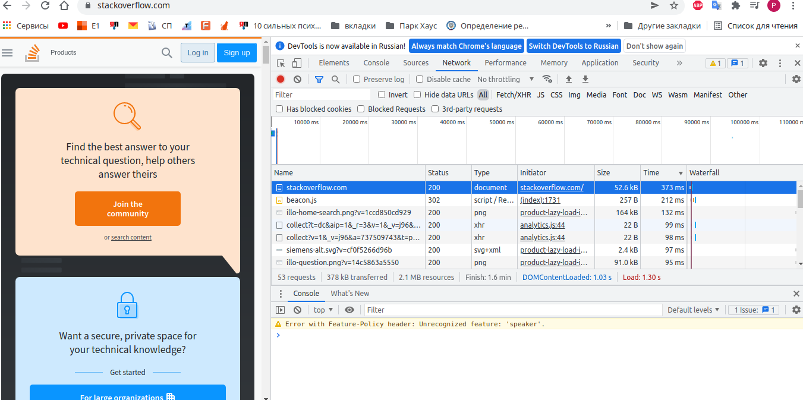

# Домашнее задание к занятию "3.6. Компьютерные сети, лекция 1"

1. Работа c HTTP через телнет.
- Подключитесь утилитой телнет к сайту stackoverflow.com
`telnet stackoverflow.com 80`
- отправьте HTTP запрос
```bash
GET /questions HTTP/1.0
HOST: stackoverflow.com
[press enter]
[press enter]
```
- В ответе укажите полученный HTTP код, что он означает?

HTTP/1.1 301 Moved Permanently

Ответ сервера, что запрашиваемый ресурс был перемещен навсегда.

2. Повторите задание 1 в браузере, используя консоль разработчика F12.
- откройте вкладку `Network`
- отправьте запрос http://stackoverflow.com
- найдите первый ответ HTTP сервера, откройте вкладку `Headers`
- укажите в ответе полученный HTTP код.

Status Code: 307 Internal Redirect

- проверьте время загрузки страницы, какой запрос обрабатывался дольше всего?
- приложите скриншот консоли браузера в ответ.



3. Какой IP адрес у вас в интернете?

```bash
user@acer-r:~$ curl ifconfig.me/ip
94.140.145.66
```
4. Какому провайдеру принадлежит ваш IP адрес? Какой автономной системе AS? Воспользуйтесь утилитой `whois`

```bash
user@acer-r:~$ whois 94.140.145.66 | grep 'role\|origin'
role:           Mobile TeleSystems PJSC Ural Branch
origin:         AS25086
user@acer-r:~$
```

5. Через какие сети проходит пакет, отправленный с вашего компьютера на адрес 8.8.8.8? Через какие AS? Воспользуйтесь утилитой `traceroute`

```bash
user@acer-r:~$ traceroute -An 8.8.8.8
traceroute to 8.8.8.8 (8.8.8.8), 30 hops max, 60 byte packets
 1  192.168.1.1 [*]  1.252 ms  1.264 ms  1.308 ms
 2  10.143.255.254 [*]  3.983 ms  3.917 ms  3.730 ms
 3  85.235.63.38 [AS25086]  3.735 ms  4.266 ms  4.203 ms
 4  212.188.18.128 [AS8359]  4.482 ms  4.413 ms  4.352 ms
 5  195.34.53.29 [AS8359]  4.292 ms  4.141 ms  4.319 ms
 6  212.188.29.85 [AS8359]  19.873 ms  19.603 ms *
 7  195.34.50.161 [AS8359]  31.635 ms  31.059 ms  30.911 ms
 8  212.188.29.82 [AS8359]  30.788 ms  30.667 ms  31.138 ms
 9  108.170.250.130 [AS15169]  33.124 ms * 108.170.250.34 [AS15169]  32.968 ms
10  * 209.85.255.136 [AS15169]  49.041 ms *
11  108.170.232.251 [AS15169]  47.630 ms 172.253.65.82 [AS15169]  47.556 ms  46.819 ms
12  216.239.49.113 [AS15169]  49.197 ms 216.239.62.15 [AS15169]  45.281 ms 172.253.51.249 [AS15169]  48.526 ms
13  * * *
14  * * *
15  * * *
16  * * *
17  * * *
18  * * *
19  * 8.8.8.8 [AS15169]  52.616 ms *
user@acer-r:~$
```
6. Повторите задание 5 в утилите `mtr`. На каком участке наибольшая задержка - delay?

```bash
user@acer-r:~$ mtr -znwc10 8.8.8.8
Start: 2021-12-07T20:40:05+0500
HOST: acer-r                  Loss%   Snt   Last   Avg  Best  Wrst StDev
  1. AS???    192.168.1.1      0.0%    10    1.3   2.0   1.3   4.7   1.0
  2. AS???    10.143.255.254   0.0%    10    4.7  18.0   2.3  48.7  17.9
  3. AS25086  85.235.63.38     0.0%    10    3.1   4.0   2.7  10.1   2.2
  4. AS8359   212.188.18.128   0.0%    10    2.8   3.6   2.8   8.1   1.6
  5. AS8359   195.34.53.29     0.0%    10   10.9   8.0   3.0  37.3  10.6
  6. AS8359   212.188.29.85    0.0%    10   18.7  20.6  18.7  29.8   3.5
  7. AS8359   195.34.50.161    0.0%    10   31.4  32.9  30.9  45.8   4.6
  8. AS8359   212.188.29.82    0.0%    10   31.1  31.2  30.8  31.8   0.3
  9. AS15169  108.170.250.51  90.0%    10   33.1  33.1  33.1  33.1   0.0
 10. AS15169  142.251.49.158  80.0%    10   46.9  51.1  46.9  55.2   5.9
 11. AS15169  216.239.57.222   0.0%    10   45.9  46.5  45.5  53.1   2.3
 12. AS15169  216.239.46.243   0.0%    10   47.2  47.4  47.0  48.2   0.4
 13. AS???    ???             100.0    10    0.0   0.0   0.0   0.0   0.0
 14. AS???    ???             100.0    10    0.0   0.0   0.0   0.0   0.0
 15. AS???    ???             100.0    10    0.0   0.0   0.0   0.0   0.0
 16. AS???    ???             100.0    10    0.0   0.0   0.0   0.0   0.0
 17. AS???    ???             100.0    10    0.0   0.0   0.0   0.0   0.0
 18. AS???    ???             100.0    10    0.0   0.0   0.0   0.0   0.0
 19. AS???    ???             100.0    10    0.0   0.0   0.0   0.0   0.0
 20. AS???    ???             100.0    10    0.0   0.0   0.0   0.0   0.0
 21. AS???    ???             100.0    10    0.0   0.0   0.0   0.0   0.0
 22. AS15169  8.8.8.8         10.0%    10   45.1  46.2  44.9  53.9   2.9
user@acer-r:~$
```
7. Какие DNS сервера отвечают за доменное имя dns.google? Какие A записи? воспользуйтесь утилитой `dig`

```bash
user@acer-r:~$ dig NS dns.google             

; <<>> DiG 9.16.8-Ubuntu <<>> NS dns.google
;; global options: +cmd
;; Got answer:
;; ->>HEADER<<- opcode: QUERY, status: NOERROR, id: 25840
;; flags: qr rd ra; QUERY: 1, ANSWER: 4, AUTHORITY: 0, ADDITIONAL: 1

;; OPT PSEUDOSECTION:
; EDNS: version: 0, flags:; udp: 65494
;; QUESTION SECTION:
;dns.google.                    IN      NS

;; ANSWER SECTION:
dns.google.             21600   IN      NS      ns2.zdns.google.
dns.google.             21600   IN      NS      ns4.zdns.google.
dns.google.             21600   IN      NS      ns3.zdns.google.
dns.google.             21600   IN      NS      ns1.zdns.google.

;; Query time: 80 msec
;; SERVER: 127.0.0.53#53(127.0.0.53)
;; WHEN: Вт дек 07 21:10:06 +05 2021
;; MSG SIZE  rcvd: 116

user@acer-r:~$ dig A dns.google

; <<>> DiG 9.16.8-Ubuntu <<>> A dns.google
;; global options: +cmd
;; Got answer:
;; ->>HEADER<<- opcode: QUERY, status: NOERROR, id: 47161
;; flags: qr rd ra; QUERY: 1, ANSWER: 2, AUTHORITY: 0, ADDITIONAL: 1

;; OPT PSEUDOSECTION:
; EDNS: version: 0, flags:; udp: 65494
;; QUESTION SECTION:
;dns.google.                    IN      A

;; ANSWER SECTION:
dns.google.             195     IN      A       8.8.8.8
dns.google.             195     IN      A       8.8.4.4

;; Query time: 0 msec
;; SERVER: 127.0.0.53#53(127.0.0.53)
;; WHEN: Вт дек 07 21:10:12 +05 2021
;; MSG SIZE  rcvd: 71

user@acer-r:~$ 
```

8. Проверьте PTR записи для IP адресов из задания 7. Какое доменное имя привязано к IP? воспользуйтесь утилитой `dig`

```bash
user@acer-r:~$ dig -x 8.8.8.8

; <<>> DiG 9.16.8-Ubuntu <<>> -x 8.8.8.8
;; global options: +cmd
;; Got answer:
;; ->>HEADER<<- opcode: QUERY, status: NOERROR, id: 8974
;; flags: qr rd ra; QUERY: 1, ANSWER: 1, AUTHORITY: 0, ADDITIONAL: 1

;; OPT PSEUDOSECTION:
; EDNS: version: 0, flags:; udp: 65494
;; QUESTION SECTION:
;8.8.8.8.in-addr.arpa.          IN      PTR

;; ANSWER SECTION:
8.8.8.8.in-addr.arpa.   4108    IN      PTR     dns.google.

;; Query time: 4 msec
;; SERVER: 127.0.0.53#53(127.0.0.53)
;; WHEN: Вт дек 07 21:15:25 +05 2021
;; MSG SIZE  rcvd: 73

user@acer-r:~$ dig -x 8.8.4.4

; <<>> DiG 9.16.8-Ubuntu <<>> -x 8.8.4.4
;; global options: +cmd
;; Got answer:
;; ->>HEADER<<- opcode: QUERY, status: NOERROR, id: 34980
;; flags: qr rd ra; QUERY: 1, ANSWER: 1, AUTHORITY: 0, ADDITIONAL: 1

;; OPT PSEUDOSECTION:
; EDNS: version: 0, flags:; udp: 65494
;; QUESTION SECTION:
;4.4.8.8.in-addr.arpa.          IN      PTR

;; ANSWER SECTION:
4.4.8.8.in-addr.arpa.   85109   IN      PTR     dns.google.

;; Query time: 4 msec
;; SERVER: 127.0.0.53#53(127.0.0.53)
;; WHEN: Вт дек 07 21:15:32 +05 2021
;; MSG SIZE  rcvd: 73

user@acer-r:~$
```

В качестве ответов на вопросы можно приложите лог выполнения команд в консоли или скриншот полученных результатов.

---

## Как сдавать задания

Обязательными к выполнению являются задачи без указания звездочки. Их выполнение необходимо для получения зачета и диплома о профессиональной переподготовке.

Задачи со звездочкой (*) являются дополнительными задачами и/или задачами повышенной сложности. Они не являются обязательными к выполнению, но помогут вам глубже понять тему.

Домашнее задание выполните в файле readme.md в github репозитории. В личном кабинете отправьте на проверку ссылку на .md-файл в вашем репозитории.

Также вы можете выполнить задание в [Google Docs](https://docs.google.com/document/u/0/?tgif=d) и отправить в личном кабинете на проверку ссылку на ваш документ.
Название файла Google Docs должно содержать номер лекции и фамилию студента. Пример названия: "1.1. Введение в DevOps — Сусанна Алиева".

Если необходимо прикрепить дополнительные ссылки, просто добавьте их в свой Google Docs.

Перед тем как выслать ссылку, убедитесь, что ее содержимое не является приватным (открыто на комментирование всем, у кого есть ссылка), иначе преподаватель не сможет проверить работу. Чтобы это проверить, откройте ссылку в браузере в режиме инкогнито.

[Как предоставить доступ к файлам и папкам на Google Диске](https://support.google.com/docs/answer/2494822?hl=ru&co=GENIE.Platform%3DDesktop)

[Как запустить chrome в режиме инкогнито ](https://support.google.com/chrome/answer/95464?co=GENIE.Platform%3DDesktop&hl=ru)

[Как запустить  Safari в режиме инкогнито ](https://support.apple.com/ru-ru/guide/safari/ibrw1069/mac)

Любые вопросы по решению задач задавайте в чате учебной группы.

---

