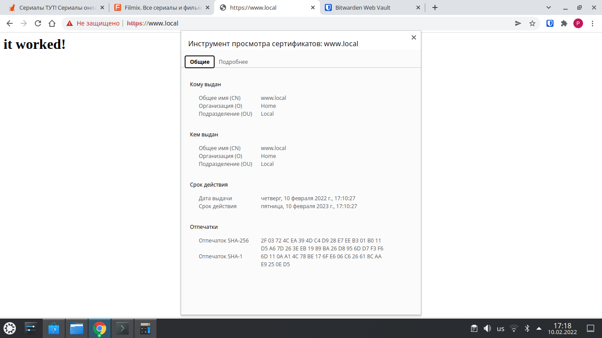

# Домашнее задание к занятию "3.9. Элементы безопасности информационных систем"

1. Установите Bitwarden плагин для браузера. Зарегестрируйтесь и сохраните несколько паролей.


2. Установите Google authenticator на мобильный телефон. Настройте вход в Bitwarden акаунт через Google authenticator OTP.


3. Установите apache2, сгенерируйте самоподписанный сертификат, настройте тестовый сайт для работы по HTTPS.



4. Проверьте на TLS уязвимости произвольный сайт в интернете (кроме сайтов МВД, ФСБ, МинОбр, НацБанк, РосКосмос, РосАтом, РосНАНО и любых госкомпаний, объектов КИИ, ВПК ... и тому подобное).

```
root@acer-r:/opt# git clone --depth 1 https://github.com/drwetter/testssl.sh.git
Клонирование в «testssl.sh»…
remote: Enumerating objects: 100, done.
remote: Counting objects: 100% (100/100), done.
remote: Compressing objects: 100% (93/93), done.
remote: Total 100 (delta 14), reused 23 (delta 6), pack-reused 0
Получение объектов: 100% (100/100), 8.55 MiB | 6.31 MiB/s, готово.
Определение изменений: 100% (14/14), готово.
root@acer-r:/opt# cd testssl.sh
root@acer-r:/opt/testssl.sh# ./testssl.sh -U --sneaky https://netology.ru/

###########################################################
    testssl.sh       3.1dev from https://testssl.sh/dev/
    (13f0388 2022-02-02 13:34:23 -- )

      This program is free software. Distribution and
             modification under GPLv2 permitted.
      USAGE w/o ANY WARRANTY. USE IT AT YOUR OWN RISK!

       Please file bugs @ https://testssl.sh/bugs/

###########################################################

 Using "OpenSSL 1.0.2-chacha (1.0.2k-dev)" [~183 ciphers]
 on acer-r:./bin/openssl.Linux.x86_64
 (built: "Jan 18 17:12:17 2019", platform: "linux-x86_64")


Testing all IPv4 addresses (port 443): 104.22.40.171 104.22.41.171 172.67.21.207
---------------------------------------------------------------------------------------------------------------
 Start 2022-02-10 17:31:43        -->> 104.22.40.171:443 (netology.ru) <<--

 Further IP addresses:   104.22.41.171 172.67.21.207 2606:4700:10::ac43:15cf 2606:4700:10::6816:29ab 2606:4700:10::6816:28ab 
 rDNS (104.22.40.171):   --
 Service detected:       HTTP


 Testing vulnerabilities 

 Heartbleed (CVE-2014-0160)                not vulnerable (OK), no heartbeat extension
 CCS (CVE-2014-0224)                       not vulnerable (OK)
 Ticketbleed (CVE-2016-9244), experiment.  not vulnerable (OK), no session tickets
 ROBOT                                     not vulnerable (OK)
 Secure Renegotiation (RFC 5746)           OpenSSL handshake didn't succeed
 Secure Client-Initiated Renegotiation     not vulnerable (OK)
 CRIME, TLS (CVE-2012-4929)                not vulnerable (OK)
 BREACH (CVE-2013-3587)                    potentially NOT ok, "gzip" HTTP compression detected. - only supplied "/" tested
                                           Can be ignored for static pages or if no secrets in the page
 POODLE, SSL (CVE-2014-3566)               not vulnerable (OK)
 TLS_FALLBACK_SCSV (RFC 7507)              Downgrade attack prevention supported (OK)
 SWEET32 (CVE-2016-2183, CVE-2016-6329)    VULNERABLE, uses 64 bit block ciphers
 FREAK (CVE-2015-0204)                     not vulnerable (OK)
 DROWN (CVE-2016-0800, CVE-2016-0703)      not vulnerable on this host and port (OK)
                                           make sure you don't use this certificate elsewhere with SSLv2 enabled services
                                           https://censys.io/ipv4?q=0E745E5E77A60345EB6E6B33B99A36286C2203D687F3377FBC685B2434518C53 could help you to find out
 LOGJAM (CVE-2015-4000), experimental      not vulnerable (OK): no DH EXPORT ciphers, no DH key detected with <= TLS 1.2
 BEAST (CVE-2011-3389)                     TLS1: ECDHE-RSA-AES128-SHA AES128-SHA ECDHE-RSA-AES256-SHA AES256-SHA DES-CBC3-SHA 
                                           VULNERABLE -- but also supports higher protocols  TLSv1.1 TLSv1.2 (likely mitigated)
 LUCKY13 (CVE-2013-0169), experimental     potentially VULNERABLE, uses cipher block chaining (CBC) ciphers with TLS. Check patches
 Winshock (CVE-2014-6321), experimental    not vulnerable (OK)
 RC4 (CVE-2013-2566, CVE-2015-2808)        no RC4 ciphers detected (OK)


 Done 2022-02-10 17:32:20 [  41s] -->> 104.22.40.171:443 (netology.ru) <<--

---------------------------------------------------------------------------------------------------------------
 Start 2022-02-10 17:32:20        -->> 104.22.41.171:443 (netology.ru) <<--

 Further IP addresses:   104.22.40.171 172.67.21.207 2606:4700:10::ac43:15cf 2606:4700:10::6816:29ab 2606:4700:10::6816:28ab 
 rDNS (104.22.41.171):   --
 Service detected:       HTTP


 Testing vulnerabilities 

 Heartbleed (CVE-2014-0160)                not vulnerable (OK), no heartbeat extension
 CCS (CVE-2014-0224)                       not vulnerable (OK)
 Ticketbleed (CVE-2016-9244), experiment.  not vulnerable (OK), no session tickets
 ROBOT                                     not vulnerable (OK)
 Secure Renegotiation (RFC 5746)           OpenSSL handshake didn't succeed
 Secure Client-Initiated Renegotiation     not vulnerable (OK)
 CRIME, TLS (CVE-2012-4929)                not vulnerable (OK)
 BREACH (CVE-2013-3587)                    potentially NOT ok, "gzip" HTTP compression detected. - only supplied "/" tested
                                           Can be ignored for static pages or if no secrets in the page
 POODLE, SSL (CVE-2014-3566)               not vulnerable (OK)
 TLS_FALLBACK_SCSV (RFC 7507)              Downgrade attack prevention supported (OK)
 SWEET32 (CVE-2016-2183, CVE-2016-6329)    VULNERABLE, uses 64 bit block ciphers
 FREAK (CVE-2015-0204)                     not vulnerable (OK)
 DROWN (CVE-2016-0800, CVE-2016-0703)      not vulnerable on this host and port (OK)
                                           make sure you don't use this certificate elsewhere with SSLv2 enabled services
                                           https://censys.io/ipv4?q=0E745E5E77A60345EB6E6B33B99A36286C2203D687F3377FBC685B2434518C53 could help you to find out
 LOGJAM (CVE-2015-4000), experimental      not vulnerable (OK): no DH EXPORT ciphers, no DH key detected with <= TLS 1.2
 BEAST (CVE-2011-3389)                     TLS1: ECDHE-RSA-AES128-SHA AES128-SHA ECDHE-RSA-AES256-SHA AES256-SHA DES-CBC3-SHA 
                                           VULNERABLE -- but also supports higher protocols  TLSv1.1 TLSv1.2 (likely mitigated)
 LUCKY13 (CVE-2013-0169), experimental     potentially VULNERABLE, uses cipher block chaining (CBC) ciphers with TLS. Check patches
 Winshock (CVE-2014-6321), experimental    not vulnerable (OK)
 RC4 (CVE-2013-2566, CVE-2015-2808)        no RC4 ciphers detected (OK)


 Done 2022-02-10 17:32:58 [  79s] -->> 104.22.41.171:443 (netology.ru) <<--

---------------------------------------------------------------------------------------------------------------
 Start 2022-02-10 17:32:58        -->> 172.67.21.207:443 (netology.ru) <<--

 Further IP addresses:   104.22.40.171 104.22.41.171 2606:4700:10::ac43:15cf 2606:4700:10::6816:29ab 2606:4700:10::6816:28ab 
 rDNS (172.67.21.207):   --
 Service detected:       HTTP


 Testing vulnerabilities 

 Heartbleed (CVE-2014-0160)                not vulnerable (OK), no heartbeat extension
 CCS (CVE-2014-0224)                       not vulnerable (OK)
 Ticketbleed (CVE-2016-9244), experiment.  not vulnerable (OK), no session tickets
 ROBOT                                     not vulnerable (OK)
 Secure Renegotiation (RFC 5746)           OpenSSL handshake didn't succeed
 Secure Client-Initiated Renegotiation     not vulnerable (OK)
 CRIME, TLS (CVE-2012-4929)                not vulnerable (OK)
 BREACH (CVE-2013-3587)                    potentially NOT ok, "gzip" HTTP compression detected. - only supplied "/" tested
                                           Can be ignored for static pages or if no secrets in the page
 POODLE, SSL (CVE-2014-3566)               not vulnerable (OK)
 TLS_FALLBACK_SCSV (RFC 7507)              Downgrade attack prevention supported (OK)
 SWEET32 (CVE-2016-2183, CVE-2016-6329)    VULNERABLE, uses 64 bit block ciphers
 FREAK (CVE-2015-0204)                     not vulnerable (OK)
 DROWN (CVE-2016-0800, CVE-2016-0703)      not vulnerable on this host and port (OK)
                                           make sure you don't use this certificate elsewhere with SSLv2 enabled services
                                           https://censys.io/ipv4?q=0E745E5E77A60345EB6E6B33B99A36286C2203D687F3377FBC685B2434518C53 could help you to find out
 LOGJAM (CVE-2015-4000), experimental      not vulnerable (OK): no DH EXPORT ciphers, no DH key detected with <= TLS 1.2
 BEAST (CVE-2011-3389)                     TLS1: ECDHE-RSA-AES128-SHA AES128-SHA ECDHE-RSA-AES256-SHA AES256-SHA DES-CBC3-SHA 
                                           VULNERABLE -- but also supports higher protocols  TLSv1.1 TLSv1.2 (likely mitigated)
 LUCKY13 (CVE-2013-0169), experimental     potentially VULNERABLE, uses cipher block chaining (CBC) ciphers with TLS. Check patches
 Winshock (CVE-2014-6321), experimental    not vulnerable (OK)
 RC4 (CVE-2013-2566, CVE-2015-2808)        no RC4 ciphers detected (OK)


 Done 2022-02-10 17:33:35 [ 116s] -->> 172.67.21.207:443 (netology.ru) <<--

---------------------------------------------------------------------------------------------------------------
Done testing now all IP addresses (on port 443): 104.22.40.171 104.22.41.171 172.67.21.207

root@acer-r:/opt/testssl.sh#
```


5. Установите на Ubuntu ssh сервер, сгенерируйте новый приватный ключ. Скопируйте свой публичный ключ на другой сервер. Подключитесь к серверу по SSH-ключу.
 
```
user@acer-r:~$ ssh-keygen -f ~/.ssh/test
Generating public/private rsa key pair.
Enter passphrase (empty for no passphrase): 
Enter same passphrase again: 
Your identification has been saved in /home/user/.ssh/test
Your public key has been saved in /home/user/.ssh/test.pub
The key fingerprint is:
SHA256:qNEqc2acN5lcTdeBcypH7FcacHBeyihK+Psaaec3z54 user@acer-r
The key's randomart image is:
+---[RSA 3072]----+
|           .o++ .|
|       .    =Bo+.|
|      . . ooo+=+ |
|     . + +.o+ o  |
|    . o S .o .   |
|   . * + o       |
|  o O * = .      |
|   * . o =  o. . |
|        ..o. +E  |
+----[SHA256]-----+
user@acer-r:~$ ssh-copy-id -i ~/.ssh/test.pub user@computer-v
/usr/bin/ssh-copy-id: INFO: Source of key(s) to be installed: "/home/user/.ssh/test.pub"
/usr/bin/ssh-copy-id: INFO: attempting to log in with the new key(s), to filter out any that are already installed
/usr/bin/ssh-copy-id: INFO: 1 key(s) remain to be installed -- if you are prompted now it is to install the new keys

Number of key(s) added: 1

Now try logging into the machine, with:   "ssh 'user@computer-v'"
and check to make sure that only the key(s) you wanted were added.

user@acer-r:~$ ssh -i ~/.ssh/test user@computer-v
Welcome to Ubuntu 20.04.3 LTS (GNU/Linux 5.4.0-99-generic x86_64)

 * Documentation:  https://help.ubuntu.com
 * Management:     https://landscape.canonical.com
 * Support:        https://ubuntu.com/advantage

0 updates can be applied immediately.

Last login: Wed Dec 22 13:24:11 2021 from 192.168.1.138
user@computer-v:~$
```

6. Переименуйте файлы ключей из задания 5. Настройте файл конфигурации SSH клиента, так чтобы вход на удаленный сервер осуществлялся по имени сервера.

```
user@acer-r:~$ mv ~/.ssh/test ~/.ssh/test_renamed
user@acer-r:~$ mv ~/.ssh/test.pub ~/.ssh/test_renamed.pub
user@acer-r:~$ nano ~/.ssh/config
user@acer-r:~$ cat ~/.ssh/config 
Host computer-v
User user
HostName computer-v
Port 22
IdentityFile ~/.ssh/test_renamed
user@acer-r:~$ ssh computer-v
Welcome to Ubuntu 20.04.3 LTS (GNU/Linux 5.4.0-99-generic x86_64)

 * Documentation:  https://help.ubuntu.com
 * Management:     https://landscape.canonical.com
 * Support:        https://ubuntu.com/advantage

14 updates can be applied immediately.
14 of these updates are standard security updates.
To see these additional updates run: apt list --upgradable

Last login: Thu Feb 10 17:40:58 2022 from 192.168.1.140
user@computer-v:~$
```

7. Соберите дамп трафика утилитой tcpdump в формате pcap, 100 пакетов. Откройте файл pcap в Wireshark.

```
root@acer-r:~# tcpdump -i wlp2s0 -c 100 -w /tmp/tcpdump.pcap
tcpdump: listening on wlp2s0, link-type EN10MB (Ethernet), capture size 262144 bytes
100 packets captured
105 packets received by filter
0 packets dropped by kernel
root@acer-r:~#
```


 ---
## Задание для самостоятельной отработки (необязательно к выполнению)

8*. Просканируйте хост scanme.nmap.org. Какие сервисы запущены?

9*. Установите и настройте фаервол ufw на web-сервер из задания 3. Откройте доступ снаружи только к портам 22,80,443


 ---

## Как сдавать задания

Обязательными к выполнению являются задачи без указания звездочки. Их выполнение необходимо для получения зачета и диплома о профессиональной переподготовке.

Задачи со звездочкой (*) являются дополнительными задачами и/или задачами повышенной сложности. Они не являются обязательными к выполнению, но помогут вам глубже понять тему.

Домашнее задание выполните в файле readme.md в github репозитории. В личном кабинете отправьте на проверку ссылку на .md-файл в вашем репозитории.

Также вы можете выполнить задание в [Google Docs](https://docs.google.com/document/u/0/?tgif=d) и отправить в личном кабинете на проверку ссылку на ваш документ.
Название файла Google Docs должно содержать номер лекции и фамилию студента. Пример названия: "1.1. Введение в DevOps — Сусанна Алиева".

Если необходимо прикрепить дополнительные ссылки, просто добавьте их в свой Google Docs.

Перед тем как выслать ссылку, убедитесь, что ее содержимое не является приватным (открыто на комментирование всем, у кого есть ссылка), иначе преподаватель не сможет проверить работу. Чтобы это проверить, откройте ссылку в браузере в режиме инкогнито.

[Как предоставить доступ к файлам и папкам на Google Диске](https://support.google.com/docs/answer/2494822?hl=ru&co=GENIE.Platform%3DDesktop)

[Как запустить chrome в режиме инкогнито ](https://support.google.com/chrome/answer/95464?co=GENIE.Platform%3DDesktop&hl=ru)

[Как запустить  Safari в режиме инкогнито ](https://support.apple.com/ru-ru/guide/safari/ibrw1069/mac)

Любые вопросы по решению задач задавайте в чате учебной группы.

---

