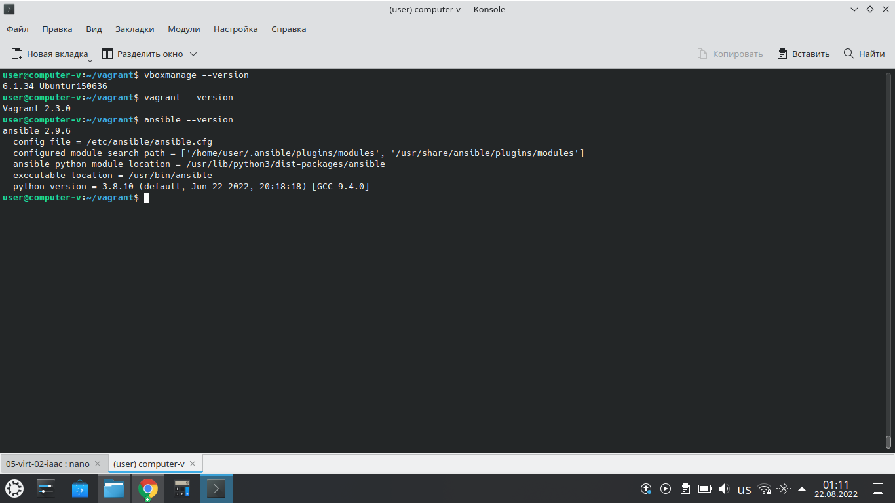
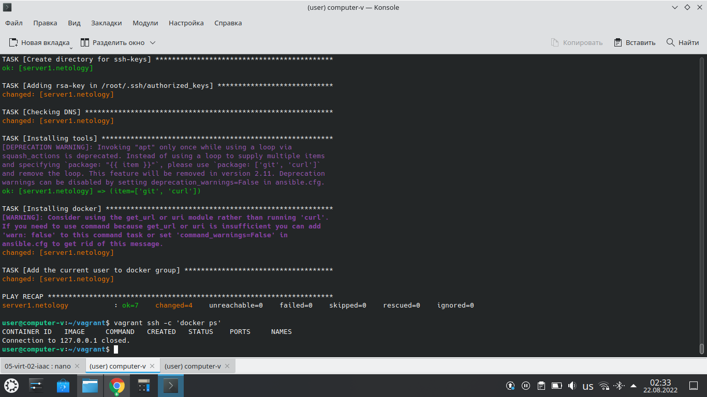

# Домашнее задание к занятию "5.2. Применение принципов IaaC в работе с виртуальными машинами"

## Как сдавать задания

Обязательными к выполнению являются задачи без указания звездочки. Их выполнение необходимо для получения зачета и диплома о профессиональной переподготовке.

Задачи со звездочкой (*) являются дополнительными задачами и/или задачами повышенной сложности. Они не являются обязательными к выполнению, но помогут вам глубже понять тему.

Домашнее задание выполните в файле readme.md в github репозитории. В личном кабинете отправьте на проверку ссылку на .md-файл в вашем репозитории.

Любые вопросы по решению задач задавайте в чате учебной группы.

---


## Важно!

Перед отправкой работы на проверку удаляйте неиспользуемые ресурсы.
Это важно для того, чтоб предупредить неконтролируемый расход средств, полученных в результате использования промокода.

Подробные рекомендации [здесь](https://github.com/netology-code/virt-homeworks/blob/virt-11/r/README.md)

---

## Задача 1

- Опишите своими словами основные преимущества применения на практике IaaC паттернов.


Ускорение предоставления инфраструктуры для разрабботки и тестирования, утсраниенение дрейфа конфигураций и стабильность среды, более быстрая разработка и тестирование продуктов.


- Какой из принципов IaaC является основополагающим?


Идемпоте́нтность (лат.idem — тот же самый + potens — способный)—это свойство объекта или операции, при повторном выполнениикоторой мы получаем результат идентичный предыдущему и всем последующим выполнениям.


## Задача 2

- Чем Ansible выгодно отличается от других систем управление конфигурациями?


Тем что готов к использованию на сущействующей инфраструктуре SSH.


- Какой, на ваш взгляд, метод работы систем конфигурации более надёжный push или pull?


Оба метода надежны, разница лишь в том кто инициирует соединение.

## Задача 3

Установить на личный компьютер:

- VirtualBox
- Vagrant
- Ansible

*Приложить вывод команд установленных версий каждой из программ, оформленный в markdown.*



## Задача 4 (*)

Воспроизвести практическую часть лекции самостоятельно.

- Создать виртуальную машину.
- Зайти внутрь ВМ, убедиться, что Docker установлен с помощью команды
```
docker ps
```



