---

# Дипломный практикум в YandexCloud
  * [Цели:](#цели)
  * [Этапы выполнения:](#этапы-выполнения)
      * [Регистрация доменного имени](#регистрация-доменного-имени)
      * [Создание инфраструктуры](#создание-инфраструктуры)
          * [Установка Nginx и LetsEncrypt](#установка-nginx)
          * [Установка кластера MySQL](#установка-mysql)
          * [Установка WordPress](#установка-wordpress)
          * [Установка Gitlab CE, Gitlab Runner и настройка CI/CD](#установка-gitlab)
          * [Установка Prometheus, Alert Manager, Node Exporter и Grafana](#установка-prometheus)
  * [Что необходимо для сдачи задания?](#что-необходимо-для-сдачи-задания)
  * [Как правильно задавать вопросы дипломному руководителю?](#как-правильно-задавать-вопросы-дипломному-руководителю)

---
## Цели:

1. Зарегистрировать доменное имя (любое на ваш выбор в любой доменной зоне).
2. Подготовить инфраструктуру с помощью Terraform на базе облачного провайдера YandexCloud.
3. Настроить внешний Reverse Proxy на основе Nginx и LetsEncrypt.
4. Настроить кластер MySQL.
5. Установить WordPress.
6. Развернуть Gitlab CE и Gitlab Runner.
7. Настроить CI/CD для автоматического развёртывания приложения.
8. Настроить мониторинг инфраструктуры с помощью стека: Prometheus, Alert Manager и Grafana.

---
## Этапы выполнения:

### Регистрация доменного имени

Подойдет любое доменное имя на ваш выбор в любой доменной зоне.

ПРИМЕЧАНИЕ: Далее в качестве примера используется домен `you.domain` замените его вашим доменом.

Рекомендуемые регистраторы:
  - [nic.ru](https://nic.ru)
  - [reg.ru](https://reg.ru)

Цель:

1. Получить возможность выписывать [TLS сертификаты](https://letsencrypt.org) для веб-сервера.

Ожидаемые результаты:

1. У вас есть доступ к личному кабинету на сайте регистратора.
2. Вы зарезистрировали домен и можете им управлять (редактировать dns записи в рамках этого домена).

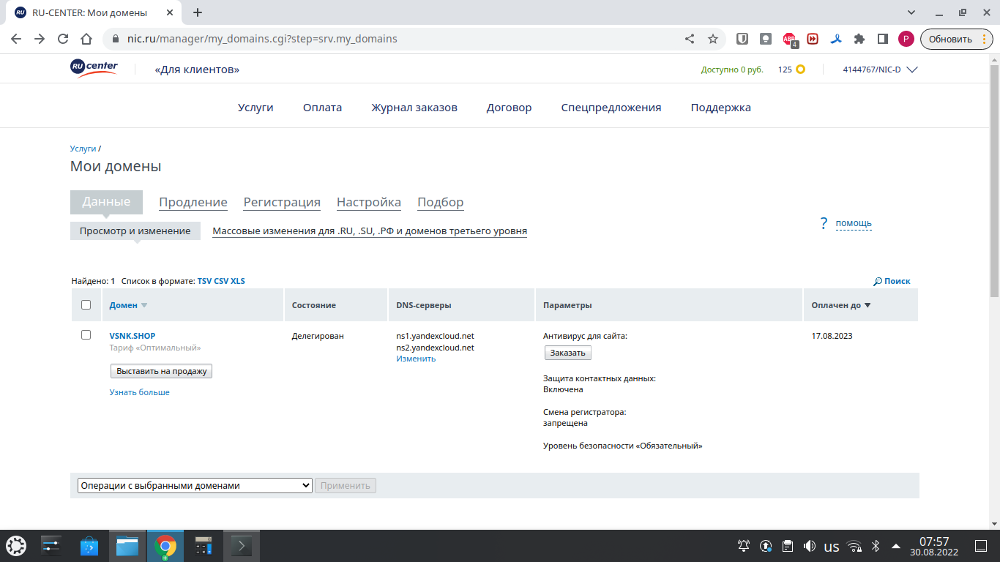

### Создание инфраструктуры

Для начала необходимо подготовить инфраструктуру в YC при помощи [Terraform](https://www.terraform.io/).

Особенности выполнения:

- Бюджет купона ограничен, что следует иметь в виду при проектировании инфраструктуры и использовании ресурсов;
- Следует использовать последнюю стабильную версию [Terraform](https://www.terraform.io/).

Предварительная подготовка:

1. Создайте сервисный аккаунт, который будет в дальнейшем использоваться Terraform для работы с инфраструктурой с необходимыми и достаточными правами. Не стоит использовать права суперпользователя
2. Подготовьте [backend](https://www.terraform.io/docs/language/settings/backends/index.html) для Terraform:
   а. Рекомендуемый вариант: [Terraform Cloud](https://app.terraform.io/)  
   б. Альтернативный вариант: S3 bucket в созданном YC аккаунте.
3. Настройте [workspaces](https://www.terraform.io/docs/language/state/workspaces.html)
   а. Рекомендуемый вариант: создайте два workspace: *stage* и *prod*. В случае выбора этого варианта все последующие шаги должны учитывать факт существования нескольких workspace.  
   б. Альтернативный вариант: используйте один workspace, назвав его *stage*. Пожалуйста, не используйте workspace, создаваемый Terraform-ом по-умолчанию (*default*).
4. Создайте VPC с подсетями в разных зонах доступности.
5. Убедитесь, что теперь вы можете выполнить команды `terraform destroy` и `terraform apply` без дополнительных ручных действий.
6. В случае использования [Terraform Cloud](https://app.terraform.io/) в качестве [backend](https://www.terraform.io/docs/language/settings/backends/index.html) убедитесь, что применение изменений успешно проходит, используя web-интерфейс Terraform cloud.

Цель:

1. Повсеместно применять IaaC подход при организации (эксплуатации) инфраструктуры.
2. Иметь возможность быстро создавать (а также удалять) виртуальные машины и сети. С целью экономии денег на вашем аккаунте в YandexCloud.

Ожидаемые результаты:

1. Terraform сконфигурирован и создание инфраструктуры посредством Terraform возможно без дополнительных ручных действий.
2. Полученная конфигурация инфраструктуры является предварительной, поэтому в ходе дальнейшего выполнения задания возможны изменения.

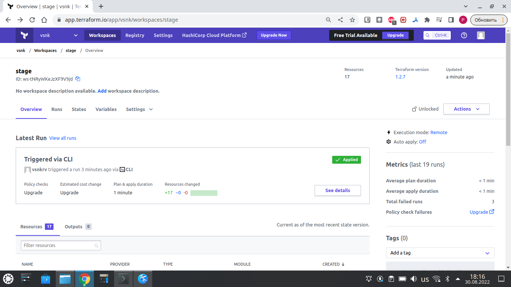

```
yandex_dns_zone.zone1: Creating...
yandex_dns_zone.zone1: Creation complete after 2s [id=dnse3ugrjiobfme32f80]
yandex_vpc_network.network-1: Creation complete after 3s [id=enpp9nh7g3pj8h7ciiaa]
yandex_vpc_subnet.subnet-1: Creating...
yandex_vpc_subnet.subnet-1: Creation complete after 1s [id=e9bdan319b7an0lm8c8b]
yandex_compute_instance.app: Creating...
yandex_compute_instance.gitlab: Creating...
yandex_compute_instance.vsnk: Creating...
yandex_compute_instance.runner: Creating...
yandex_compute_instance.monitoring: Creating...
yandex_compute_instance.db02: Creating...
yandex_compute_instance.db01: Creating...
yandex_compute_instance.app: Still creating... [10s elapsed]
yandex_compute_instance.vsnk: Still creating... [10s elapsed]
yandex_compute_instance.gitlab: Still creating... [10s elapsed]
yandex_compute_instance.monitoring: Still creating... [10s elapsed]
yandex_compute_instance.db01: Still creating... [10s elapsed]
yandex_compute_instance.db02: Still creating... [10s elapsed]
yandex_compute_instance.runner: Still creating... [10s elapsed]
yandex_compute_instance.app: Still creating... [20s elapsed]
yandex_compute_instance.gitlab: Still creating... [20s elapsed]
yandex_compute_instance.vsnk: Still creating... [20s elapsed]
yandex_compute_instance.runner: Still creating... [20s elapsed]
yandex_compute_instance.db02: Still creating... [20s elapsed]
yandex_compute_instance.db01: Still creating... [20s elapsed]
yandex_compute_instance.monitoring: Still creating... [20s elapsed]
yandex_compute_instance.gitlab: Creation complete after 27s [id=fhmmnt9a39g1954ncm8b]
yandex_compute_instance.monitoring: Creation complete after 27s [id=fhmev9665ssnooamsf18]
yandex_compute_instance.app: Still creating... [30s elapsed]
yandex_compute_instance.vsnk: Still creating... [30s elapsed]
yandex_compute_instance.db01: Still creating... [30s elapsed]
yandex_compute_instance.runner: Still creating... [30s elapsed]
yandex_compute_instance.db02: Still creating... [30s elapsed]
yandex_compute_instance.db02: Creation complete after 31s [id=fhmeoeva6abgiq8apa3k]
yandex_compute_instance.vsnk: Creation complete after 31s [id=fhmr7465m3tj1ggm1osj]
yandex_dns_recordset.grafana: Creating...
yandex_dns_recordset.vsnk: Creating...
yandex_dns_recordset.app: Creating...
yandex_dns_recordset.prometheus: Creating...
yandex_dns_recordset.alertmanager: Creating...
yandex_dns_recordset.gitlab: Creating...
yandex_compute_instance.db01: Creation complete after 31s [id=fhmongkrddv92q58a956]
yandex_compute_instance.app: Creation complete after 31s [id=fhm8vb7au8cnf79900ns]
yandex_dns_recordset.vsnk: Creation complete after 0s [id=dnse3ugrjiobfme32f80/vsnk.shop./A]
yandex_dns_recordset.app: Creation complete after 0s [id=dnse3ugrjiobfme32f80/www.vsnk.shop./A]
yandex_dns_recordset.gitlab: Creation complete after 1s [id=dnse3ugrjiobfme32f80/gitlab.vsnk.shop./A]
yandex_compute_instance.runner: Creation complete after 32s [id=fhmoj7sqliakrpbq2ruo]
local_file.inventory: Creating...
local_file.inventory: Creation complete after 0s [id=a051848233824748129574f6839ac1e6fb4eb5dc]
yandex_dns_recordset.prometheus: Creation complete after 1s [id=dnse3ugrjiobfme32f80/prometheus.vsnk.shop./A]
yandex_dns_recordset.grafana: Creation complete after 1s [id=dnse3ugrjiobfme32f80/grafana.vsnk.shop./A]
yandex_dns_recordset.alertmanager: Creation complete after 2s [id=dnse3ugrjiobfme32f80/alertmanager.vsnk.shop./A]

Apply complete! Resources: 17 added, 0 changed, 0 destroyed.
```

---
### Установка Nginx и LetsEncrypt

Необходимо разработать Ansible роль для установки Nginx и LetsEncrypt.

**Для получения LetsEncrypt сертификатов во время тестов своего кода пользуйтесь [тестовыми сертификатами](https://letsencrypt.org/docs/staging-environment/), так как количество запросов к боевым серверам LetsEncrypt [лимитировано](https://letsencrypt.org/docs/rate-limits/).**

Рекомендации:
  - Имя сервера: `you.domain`
  - Характеристики: 2vCPU, 2 RAM, External address (Public) и Internal address.

Цель:

1. Создать reverse proxy с поддержкой TLS для обеспечения безопасного доступа к веб-сервисам по HTTPS.

Ожидаемые результаты:

1. В вашей доменной зоне настроены все A-записи на внешний адрес этого сервера:
    - `https://www.you.domain` (WordPress)
    - `https://gitlab.you.domain` (Gitlab)
    - `https://grafana.you.domain` (Grafana)
    - `https://prometheus.you.domain` (Prometheus)
    - `https://alertmanager.you.domain` (Alert Manager)
2. Настроены все upstream для выше указанных URL, куда они сейчас ведут на этом шаге не важно, позже вы их отредактируете и укажите верные значения.
2. В браузере можно открыть любой из этих URL и увидеть ответ сервера (502 Bad Gateway). На текущем этапе выполнение задания это нормально!

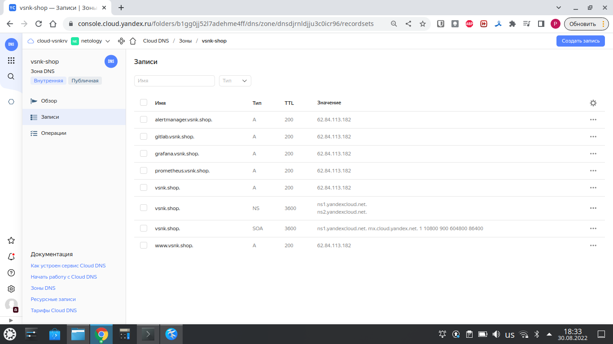

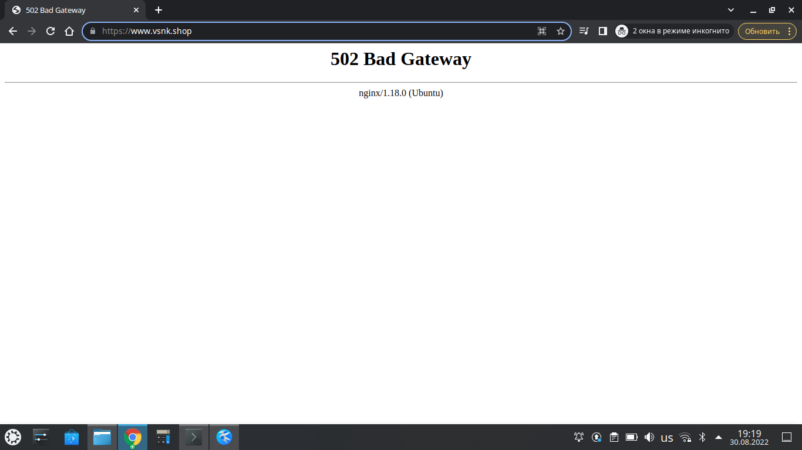

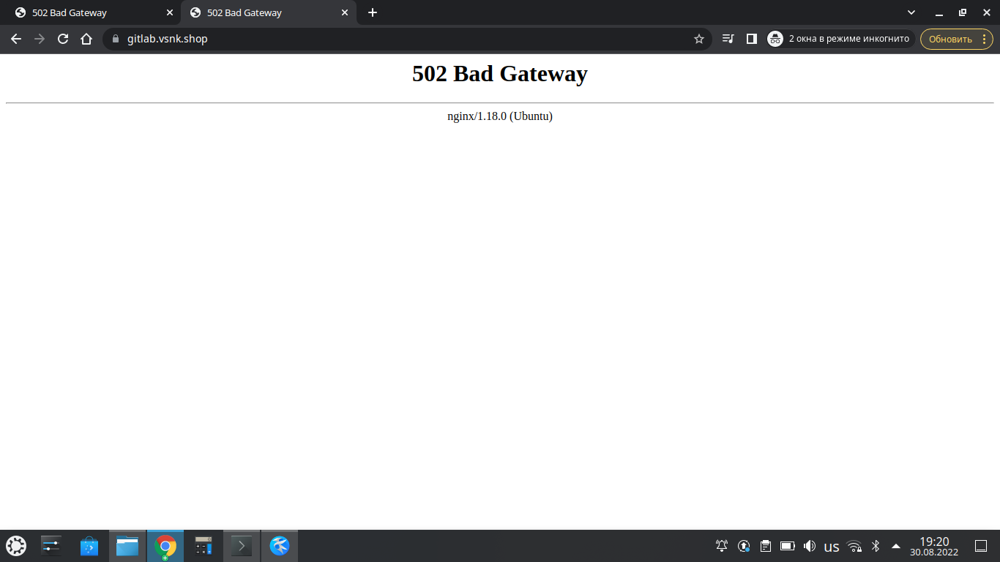

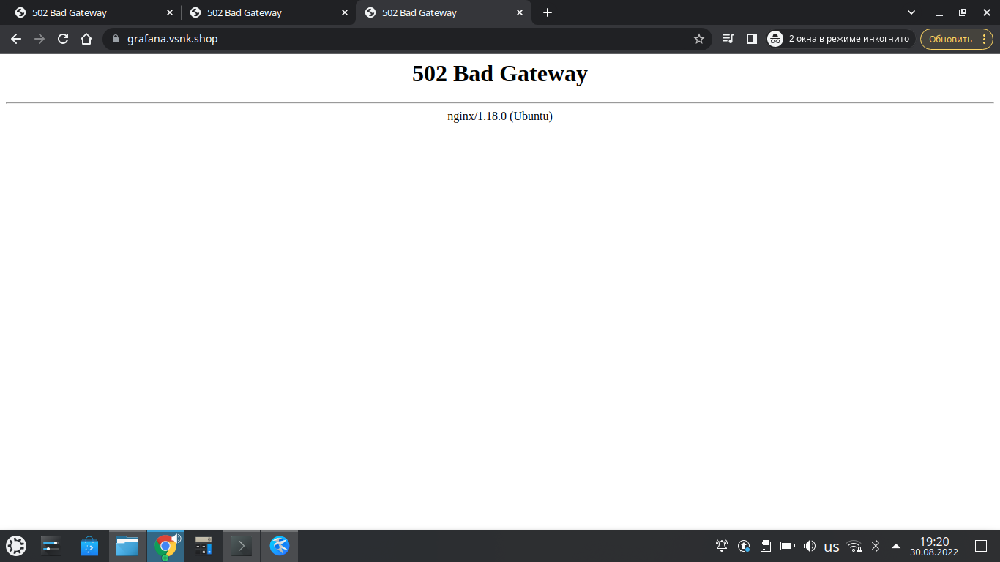

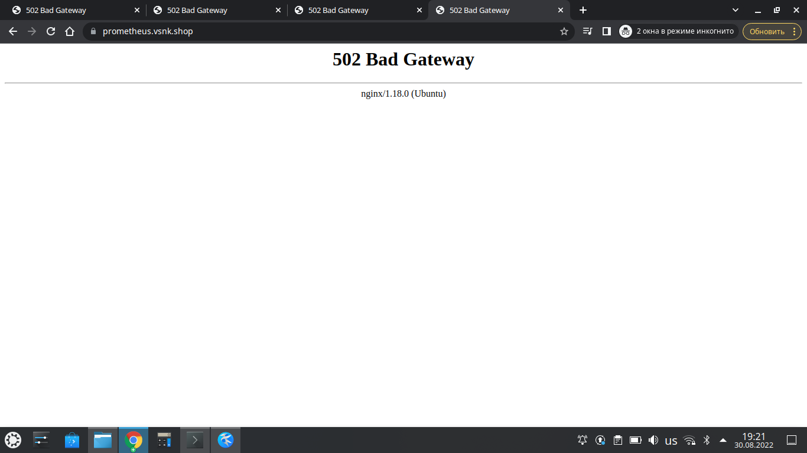

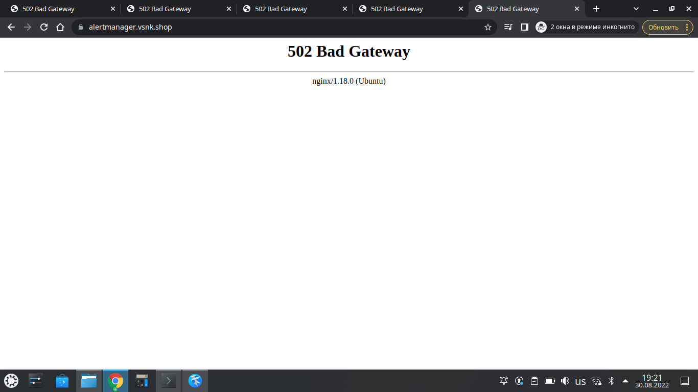

___
### Установка кластера MySQL

Необходимо разработать Ansible роль для установки кластера MySQL.

Рекомендации:
  - Имена серверов: `db01.you.domain` и `db02.you.domain`
  - Характеристики: 4vCPU, 4 RAM, Internal address.

Цель:

1. Получить отказоустойчивый кластер баз данных MySQL.

Ожидаемые результаты:

1. MySQL работает в режиме репликации Master/Slave.
2. В кластере автоматически создаётся база данных c именем `wordpress`.
3. В кластере автоматически создаётся пользователь `wordpress` с полными правами на базу `wordpress` и паролем `wordpress`.

**Вы должны понимать, что в рамках обучения это допустимые значения, но в боевой среде использование подобных значений не приемлимо! Считается хорошей практикой использовать логины и пароли повышенного уровня сложности. В которых будут содержаться буквы верхнего и нижнего регистров, цифры, а также специальные символы!**

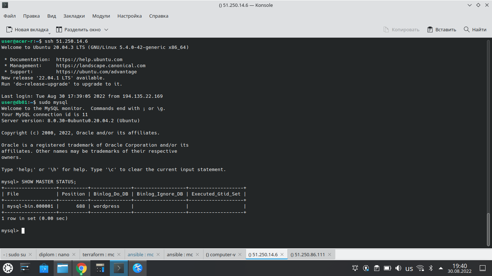

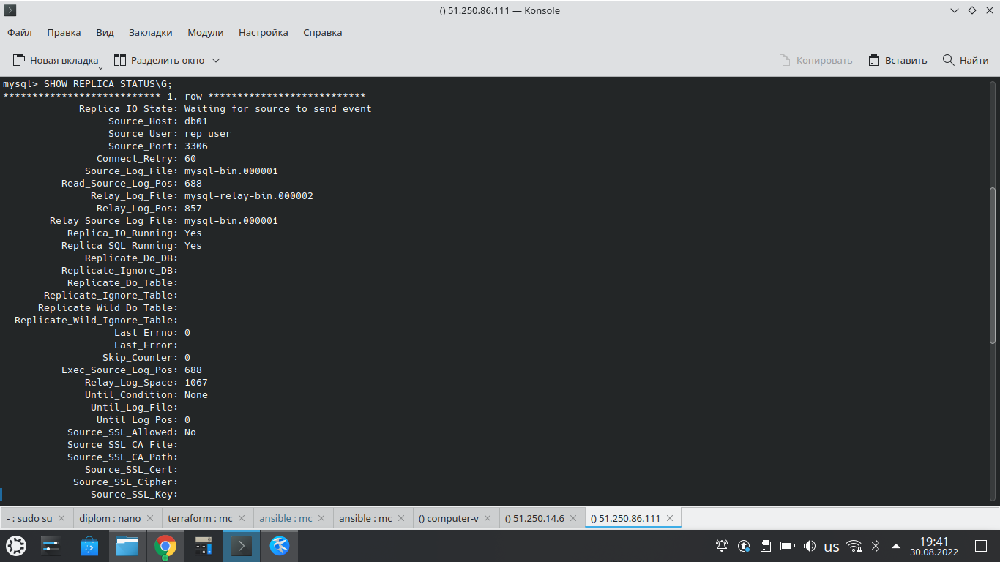

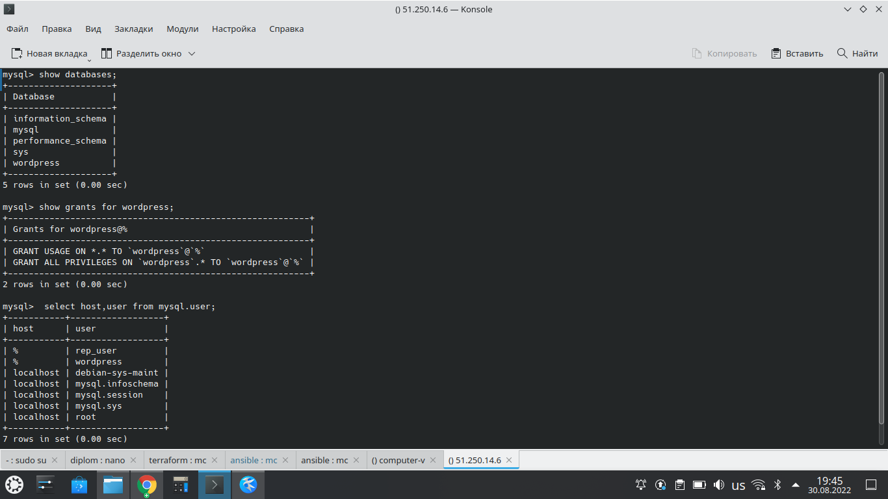

___
### Установка WordPress

Необходимо разработать Ansible роль для установки WordPress.

Рекомендации:
  - Имя сервера: `app.you.domain`
  - Характеристики: 4vCPU, 4 RAM, Internal address.

Цель:

1. Установить [WordPress](https://wordpress.org/download/). Это система управления содержимым сайта ([CMS](https://ru.wikipedia.org/wiki/Система_управления_содержимым)) с открытым исходным кодом.


По данным W3techs, WordPress используют 64,7% всех веб-сайтов, которые сделаны на CMS. Это 41,1% всех существующих в мире сайтов. Эту платформу для своих блогов используют The New York Times и Forbes. Такую популярность WordPress получил за удобство интерфейса и большие возможности.

Ожидаемые результаты:

1. Виртуальная машина на которой установлен WordPress и Nginx/Apache (на ваше усмотрение).
2. В вашей доменной зоне настроена A-запись на внешний адрес reverse proxy:
    - `https://www.you.domain` (WordPress)
3. На сервере `you.domain` отредактирован upstream для выше указанного URL и он смотрит на виртуальную машину на которой установлен WordPress.
4. В браузере можно открыть URL `https://www.you.domain` и увидеть главную страницу WordPress.

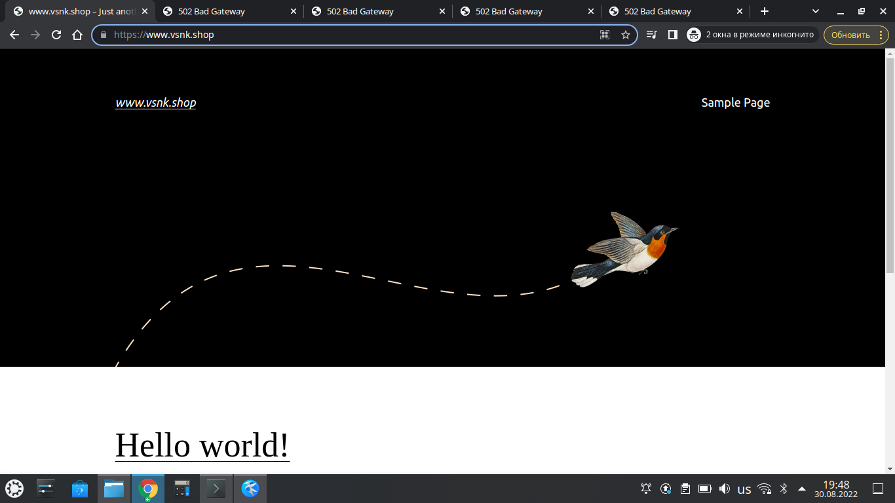

---
### Установка Gitlab CE и Gitlab Runner

Необходимо настроить CI/CD систему для автоматического развертывания приложения при изменении кода.

Рекомендации:
  - Имена серверов: `gitlab.you.domain` и `runner.you.domain`
  - Характеристики: 4vCPU, 4 RAM, Internal address.

Цель:
1. Построить pipeline доставки кода в среду эксплуатации, то есть настроить автоматический деплой на сервер `app.you.domain` при коммите в репозиторий с WordPress.

Подробнее об [Gitlab CI](https://about.gitlab.com/stages-devops-lifecycle/continuous-integration/)

Ожидаемый результат:

1. Интерфейс Gitlab доступен по https.
2. В вашей доменной зоне настроена A-запись на внешний адрес reverse proxy:
    - `https://gitlab.you.domain` (Gitlab)
3. На сервере `you.domain` отредактирован upstream для выше указанного URL и он смотрит на виртуальную машину на которой установлен Gitlab.
3. При любом коммите в репозиторий с WordPress и создании тега (например, v1.0.0) происходит деплой на виртуальную машину.

Создаем новый проект, название - wordpress.

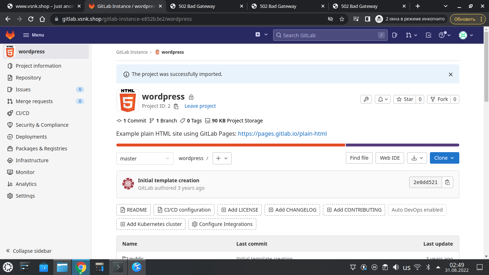

Клонируем этот проект себе и меняем содержимое файла .gitlab-ci.yml

Далее пушим изменения в репозиторий, добавляем тэг v1.0.0 и пушим его в репозиторий.

```
user@acer-r:~$ git clone http://gitlab.vsnk.shop/gitlab-instance-e852b3e2/wordpress.git
Клонирование в «wordpress»…
Username for 'https://gitlab.vsnk.shop': root
Password for 'https://root@gitlab.vsnk.shop': 
warning: переадресация на https://gitlab.vsnk.shop/gitlab-instance-e852b3e2/wordpress.git/
remote: Enumerating objects: 7, done.
remote: Total 7 (delta 0), reused 0 (delta 0), pack-reused 7
Получение объектов: 100% (7/7), готово.
user@acer-r:~$ cd wordpress/
user@acer-r:~/wordpress$ ls -l
итого 4
drwxrwxr-x 2 user user   41 авг 31 02:50 public
-rw-rw-r-- 1 user user 2213 авг 31 02:50 README.md
user@acer-r:~/wordpress$ nano .gitlab-ci.yml
user@acer-r:~/wordpress$ cat .gitlab-ci.yml 
stages:
  - deploy

deploy:
  stage: deploy
  only:
    variables:
      - $CI_COMMIT_TAG =~ /v(\d+\.\d+\.\d+)/

  script:
    - rsync -rult $CI_PROJECT_DIR/ root@app:/var/www/vsnk.shop/
user@acer-r:~/wordpress$ git add .gitlab-ci.yml 
user@acer-r:~/wordpress$ git commit -m 'update .gitlab-ci.yml'
[master 749b2e8] update .gitlab-ci.yml
 1 file changed, 8 insertions(+), 8 deletions(-)
user@acer-r:~/wordpress$ git push
Username for 'https://gitlab.vsnk.shop': root
Password for 'https://root@gitlab.vsnk.shop': 
warning: переадресация на https://gitlab.vsnk.shop/gitlab-instance-e852b3e2/wordpress.git/
Перечисление объектов: 5, готово.
Подсчет объектов: 100% (5/5), готово.
При сжатии изменений используется до 4 потоков
Сжатие объектов: 100% (3/3), готово.
Запись объектов: 100% (3/3), 464 байта | 464.00 КиБ/с, готово.
Всего 3 (изменений 0), повторно использовано 0 (изменений 0), повторно использовано пакетов 0
To http://gitlab.vsnk.shop/gitlab-instance-e852b3e2/wordpress.git
   2e0dd52..749b2e8  master -> master
user@acer-r:~/wordpress$ git tag -a v1.0.0 -m 'v1.0.0'
user@acer-r:~/wordpress$ git push --tags
Username for 'https://gitlab.vsnk.shop': root
Password for 'https://root@gitlab.vsnk.shop': 
warning: переадресация на https://gitlab.vsnk.shop/gitlab-instance-e852b3e2/wordpress.git/
Перечисление объектов: 1, готово.
Подсчет объектов: 100% (1/1), готово.
Запись объектов: 100% (1/1), 159 байтов | 159.00 КиБ/с, готово.
Всего 1 (изменений 0), повторно использовано 0 (изменений 0), повторно использовано пакетов 0
To http://gitlab.vsnk.shop/gitlab-instance-e852b3e2/wordpress.git
 * [new tag]         v1.0.0 -> v1.0.0
user@acer-r:~/wordpress$
```

Видим, что job запустился и отработал.

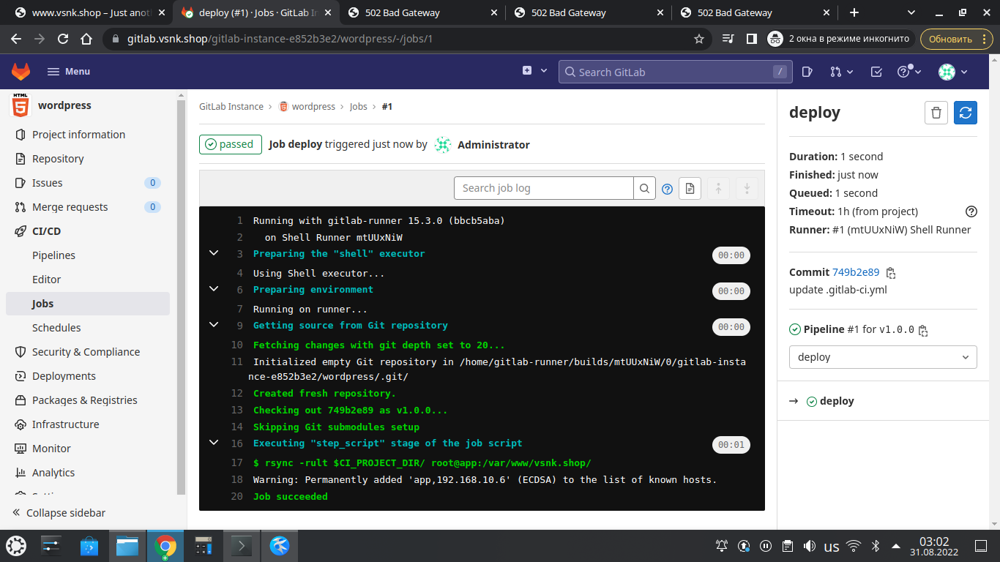

На сайте появились файлы из репозитория wordpress.

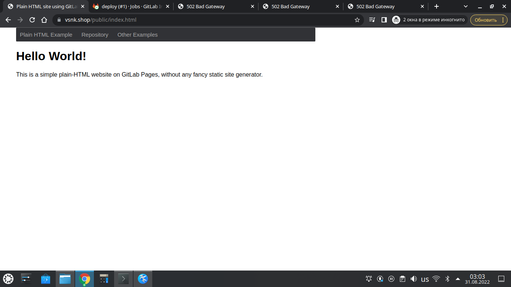

___
### Установка Prometheus, Alert Manager, Node Exporter и Grafana

Необходимо разработать Ansible роль для установки Prometheus, Alert Manager и Grafana.

Рекомендации:
  - Имя сервера: `monitoring.you.domain`
  - Характеристики: 4vCPU, 4 RAM, Internal address.

Цель:

1. Получение метрик со всей инфраструктуры.

Ожидаемые результаты:

1. Интерфейсы Prometheus, Alert Manager и Grafana доступены по https.
2. В вашей доменной зоне настроены A-записи на внешний адрес reverse proxy:
  - `https://grafana.you.domain` (Grafana)
  - `https://prometheus.you.domain` (Prometheus)
  - `https://alertmanager.you.domain` (Alert Manager)
3. На сервере `you.domain` отредактированы upstreams для выше указанных URL и они смотрят на виртуальную машину на которой установлены Prometheus, Alert Manager и Grafana.
4. На всех серверах установлен Node Exporter и его метрики доступны Prometheus.
5. У Alert Manager есть необходимый [набор правил](https://awesome-prometheus-alerts.grep.to/rules.html) для создания алертов.
2. В Grafana есть дашборд отображающий метрики из Node Exporter по всем серверам.
3. В Grafana есть дашборд отображающий метрики из MySQL (*).
4. В Grafana есть дашборд отображающий метрики из WordPress (*).

*Примечание: дашборды со звёздочкой являются опциональными заданиями повышенной сложности их выполнение желательно, но не обязательно.*

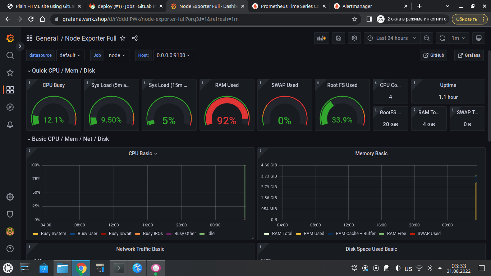

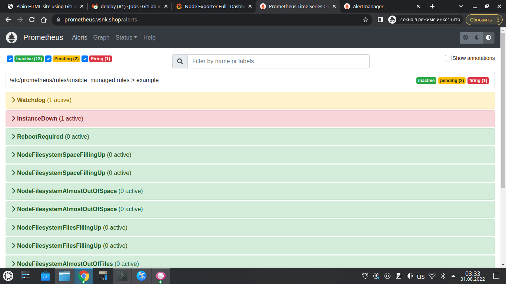

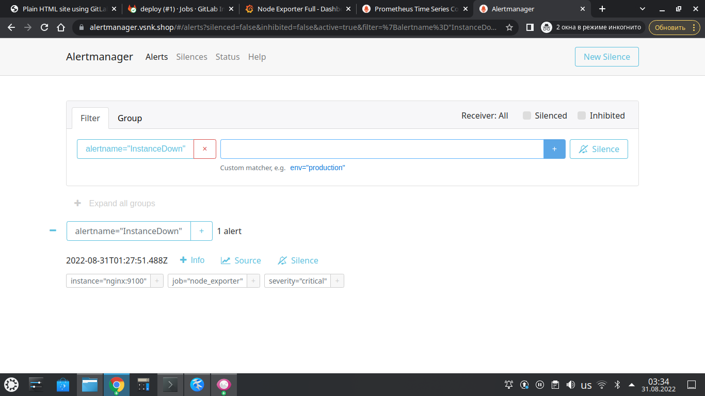

---

## Что необходимо для сдачи задания?

1. Репозиторий со всеми Terraform манифестами и готовность продемонстрировать создание всех ресурсов с нуля.
2. Репозиторий со всеми Ansible ролями и готовность продемонстрировать установку всех сервисов с нуля.
3. Скриншоты веб-интерфейсов всех сервисов работающих по HTTPS на вашем доменном имени.
  - `https://www.you.domain` (WordPress)
  - `https://gitlab.you.domain` (Gitlab)
  - `https://grafana.you.domain` (Grafana)
  - `https://prometheus.you.domain` (Prometheus)
  - `https://alertmanager.you.domain` (Alert Manager)
4. Все репозитории рекомендуется хранить на одном из ресурсов ([github.com](https://github.com) или [gitlab.com](https://gitlab.com)).

